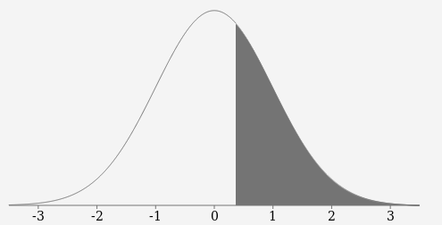

# randomness_test

This is a repo for test of randomness.

## Entropy measurement

This could give one measurement of the randomness. We have normalized the entropy. So the value is always between 0 and 1. The larger the entropy is, the more random it is. To get more information about entropy you can refer https://en.wikipedia.org/wiki/Entropy_(information_theory)

## How to run
`node entropy/entropy.js ./data/random.json`

The output is :

The input file length is : 15000

The unique number count is: 13414

The entropy is: 0.9843445072616206

## Chi-Squared test

The output for chi-squared is :

The input file length is : 15000

The chi-squared output is : 65399.5648

The normalized chi squared value(which can be compared with standard normal distribution): 0.37685255903337017

The Area is 0.3557.

# The result for ticket 1 and ticket 2

## Ticket 1 

The input file length is : 15000

The unique number count is: 13380

The entropy is: 0.9839585986885104

The input file length is : 15000

The chi-squared output is : 65845.2096

The normalized chi squared value(which can be compared with standard normal distribution): 0.8540789256561768

## Ticket 2
The input file length is : 15000

The unique number count is: 13420

The entropy is: 0.9843526587175867

The input file length is : 15000

The chi-squared output is : 65469.469866666666

The normalized chi squared value(which can be compared with standard normal distribution): -0.18376526731736478

# Display the plot of blockHash 

Open the display/index.html using a broswer

# Summary

We did the random analysis for the number generated by our system. The sample is 15000 numbers which are in the range 0-65535.
We accomplished two kinds of analysis on them: entropy and chi-squared test. Entropy value could be used measure the randomness of a group of numbers. We normalized the entropy value to be between 0 and 1.  The larger the normalized entropy value is, we have more confidence to say the the group numbers are generated by the random generator. The value we got is: 0.984 which is very good. For the chi-squared test, we normalized the chi-squared valued by the degree of freedom. Thus we can compare it with a standard normal distribution. The value we got is:0.376 which we can say it pass the chi-squared test. Based on the two analysis we have, it is good to say those numbers are random enough.   

